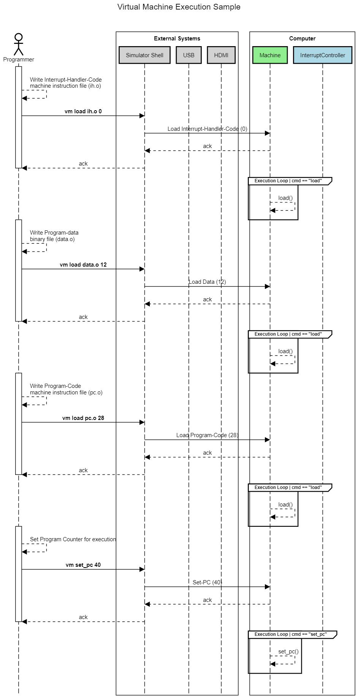
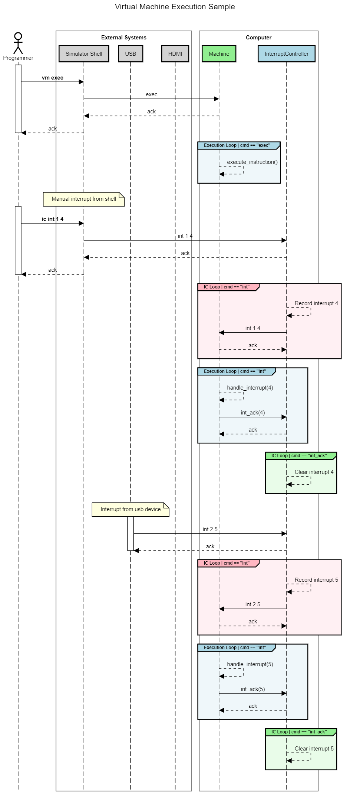
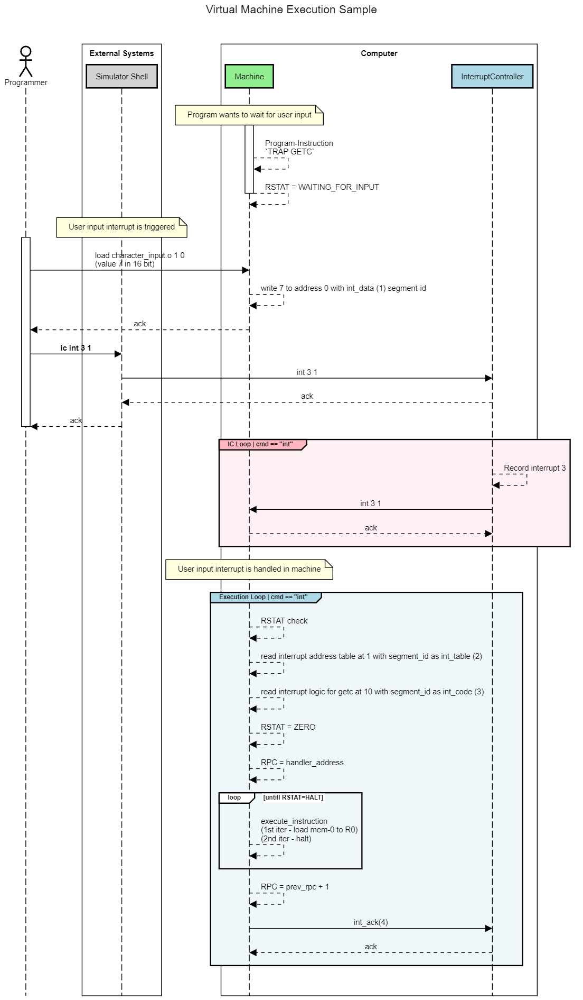
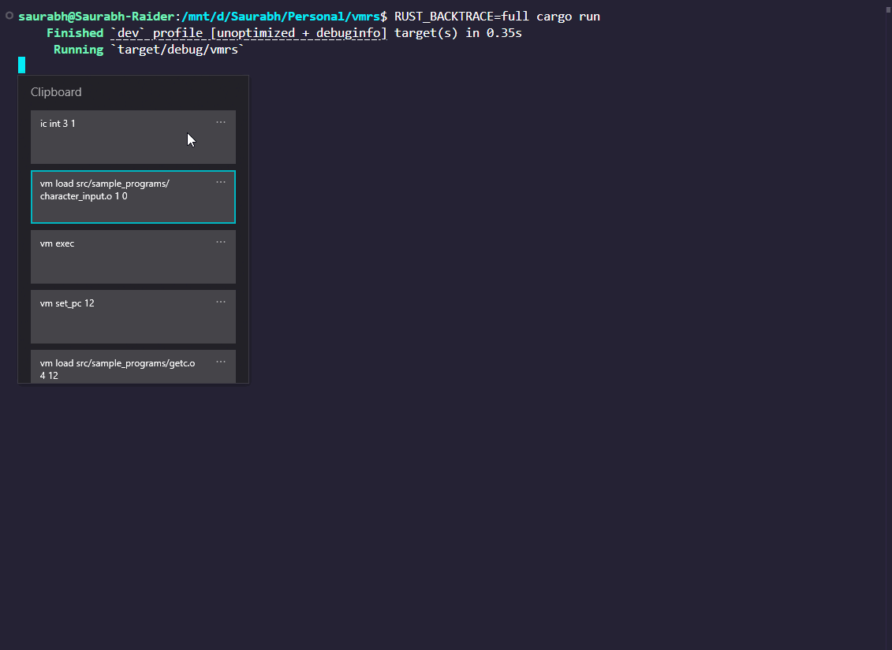

# Overview
Implementation of 16-bit virtual machine (VM). **Please note that this implementation is inspired by LC3 but does not completely follow it, infact implements instructions and design using my own intuition.**

# Implementation
## What value and API does a VM provide?
- A virtual machine is a mock for a real machine, in our case a CPU.
- The main value that CPU provides is to run instructions.
- This implementation is inspired by `LC-3 architecture` of a CPU to build the virtual machine BUT would not implement or follow it completely. 
- To run the machine, a program code has to be provided which is nothing but an array of instructions.
- The instructions themselves need to be in machine code, each instruction being a 16-bit value.
- The machine will simply execute and step through each instruction of the program one at a time.
- The instruction-set would be of Assembly language as it is smaller and easier to implement.
- The above is sufficient if we do have a machine which can not be interrupted (given additional input) during its execution.
- To add support of `interruption` of machine, we need a way for machine to be able to take new input, process it and generate a response of the execution of the input.     

## How does it work internally?
- Machine needs to do take data, take instructions and do their calculations and produce results.
- Machine also needs to listen to external events such as IO devices.
- Machine needs a way for taking and storing the data, instructions and results. This is where **memory** comes.
- Machine needs to perform calculations for instructions, that calculation happens in the logic gates implemented in the hardware of the machine and is encapsulated in the form of **registers**.
- Data need to be sent to registers from memory and register is instructed to perform the operation.
- [`Interrupts`](https://en.wikipedia.org/wiki/Interrupt) can be given only between instructions and not in between. In real hardware interrupts are enabled by having dedicated interrupt input pins for external systems which set the value as per the interrupt they want to trigger and the circuit of CPU is built in a way that in each instruction cycle, if the pin values are off, the normal instruction would be executed and if not, the circuit of interrupt handling branch will get enabled. In software, dedicated registers (special purpose registers) or dedicated memory (memory mapped registers) can be used to track the interrupt status.
- In this VM however, we would make the yield control back after each instruction cycle so that pending interrupts can be read and processed.
- An additional module, called, `Interrupt Controller` which can take input from user / external systems and pass on to CPU is added as well. A separate module is needed because we want the machine to not be impacted mid-instruction execution cycle if interrupts are generated and we don't want external modules to not be able to create interrupts if the CPU is busy.

## Components
Three components to enable above -
- Machine - simulates the CPU
- Interrupt Controller - simulates the interrupt pins and dedicated interrupt controller in a real hardware
- Simulator (`main.rs`) - performs two tasks -
    - Enables an user-interface (CLI) for external systems (programmer) to use the machine as well interrupt controller.
    - Runs the above two systems in dedicated threads for them to be non blocking. 

### Machine
- Machine has three components -
    - **Registers -** For control purpose. Each register can hold a 16 bit value. There are 10 registers in this implementation -
        - R0-R7 - value storage during instruction execution
        - RPC - program counter for machine to track which instruction to be executed
        - RCOND - value storage of previous instructions for conditional instructions
    - **Memory -** For data storage purpose only. This provides a larger storage area than registers and is used purely for storage of data that can not be fit into storage registers (R0-R7). Each memory slot can also hold a 16-bit value.
        - Machine also provides a virtual component called **"Memory Mapped Registers"** which is nothing but memory area which will be used for control purpose of dynamic usecases such as handling IO from devices. Dedicated registers are not used for this because memory is more dispensable than registers.
- Machine exposes three APIs -
    - `Load()` - any arbitrary data in the memory. Programmer should use it to vm load data and program code into memory at desired addresses. (This is programmer's responsibility that the addresses of the data in the program code point correctly to the loaded data in memory.)
    - `Run()` - run the program code stored at given address. Machine sets `RPC` to that address and performs exactly one instruction cycle.
    - `HandleInterrupt(interrupt)` - runs the handler code corresponding to the given interrupt. This will be called manually by interrupt controller if needed. The handling happens in below steps -
        - For each interrupt id that needs to be handled, the logic (instructions) to handle it should be loaded into the memory using `load` API.
        - A mapping of interrupt id to memory address of interrupt handler logic should be loaded into the memory using `load` API.
        - CPU also needs to know the address of this mapping in memory to refer to. I am not sure how real machine does it, for now, I am going to use a hardcoded address of `0x0` to store the mapping. This would work because size of each part of the table and program code can be pre-calculated definteively by the programmer before uploading them into the machine.
- Machine keeps loading the instruction at the memory address referred by `RPC` and executing the business logic of that instruction. If the instruction is `OP_TRAP` with `TRAP_HALT`, machine exits the program.

### Interrupt Controller
- Interrupt Controller has a single component **Pending Interrupt Queue** where any incoming and non-handled interrupts are stored.
- We will model each interrupt as a single 8 bit data item with following format - `Device-id (4 bits) | Interrupt-id (4 bits)`. Interrupts themselves are simple signal mechanisms of an event happening and do not carry with them the data of the event. The data of the event should be put into an area commonly accessible by the external system as well as CPU. Such area can be CPU memory and special registers (such as Memory mapped registers) or dedicated managed-memory (separate from CPU, accessible via MMU - Memory Management Unit). In the former case, external system can use vm's `load` API and then use interrupt-controller's `int` API.
- It exposes two APIs -
    - `Int(interrupt)` - Adds an interrupt to the pending queue. It may discard them as well depending on if they are duplicate or too soon or any other factor. This will be called by the external systems. 
    - `IntA(interrupt)` - Acknowledges an interrupt handling to be complete and removes it from pending interrupts queue. This will be called based on interrupt handling response from CPU. 

## Exmaple Flow
### Setting up the machine and the program


[(source)](https://sequencediagram.org/index.html#initialData=C4S2BsFMAIDUQE7AK4ENzQLKoMYAsQA7GAUQA9IdlQB7Q6AZVQFsAHKAKA92BoWgBEABQQ0A5ghbNICAdFQBnaKw6tUSEDhBrCwCTWStoAKmPlgMwukYBPBReYLV60Fp3BBDEM2ThUvfgY8SHBwOUVoSAUlAGJwEDE8PUkbZw03VF1BAFUGACFwpSjkaDiEpIlUVLV07UyPAQAJABFMAElCyIU8UvjE5KqOSEIAEzTXOt19QxNjAGEaNmoZcc1Jhux8IkhOgDdmXvLkyGHVjKyBNt0ZBENgBd1RUJlOzUP+gCNwZEgh0a4eCBdv4YCpWABacEAPlYAC4AOoIMAwK4WBC3VjAcGNTIjKAIcELEaQAA6hGYuAIxGgRHstxwtHoADMQFBoAAKEB4AB0NAAlKpoVEFLDTPtoOAaKgRjSeTRoAAGUxDaLQ-awgAyUplqJud2xuPxhJoxI5CoFwoAPJD1bgANaqa3g4Ww+0cYmA4EWZQcaZGciUaggOjQLU0IwAH2gOGYMoAvHHBJLpQIOPtIVD1cmRuyLf9uAygSCfRDoXDEcjoCJxJJmOCRv5UGSPkR1DZoCy2eyG8BULyBRCoS6xQds9Ae335QBGABMyuFauYmu10GajY5s4t0SdtpwDtYTpdbo9ha9oN9ohmAaojNDNHD0CjMfjiYE2dT6cXsOzub+YwLoBniWGblki3rVpUdZEqS5KUtsNKEHSyCFiGnYwOyrA4P2gpDtEorGOKY6Yby0AzgAHPOqqZkuWrSlWoiQcaprsuRW4KDuS5ugekJHnu7qQJ6xYqH60DXkGIZhpG0axtACZJtqH51l+P55v+gnemCIGwgwkAeBBtbQAsyDXPwTJ8JEFA3sGhA4cOBEHAoukAPqYdAAAsSrGCqChfjpWJCHMHIeWxHGunx3HOnhx4CaeQkXgY-qWeJ9CSY+0kvoIjnAC5OCKRm6pZTlv7DGMQA)

### Running the program and handling interrupts


[(source)](https://sequencediagram.org/index.html#initialData=C4S2BsFMAIDUQE7AK4ENzQLKoMYAsQA7GAUQA9IdlQB7Q6AZVQFsAHKAKA92BoWgBEABQQ0A5ghbNICAdFQBnaKw6tUSEDhBrCwCTWStoAKmPlgMwukYBPBReYLV60Fp3BBDEM2ThUvfgY8SHBwOUVoSAUlAGJwEDE8PUkbZw03VF1BAFUGACFwpSjkaDiEpIlUVLV07UyPAQAJABFMAElCyIU8UvjE5KqOSEIAEzTXOt19QxNjAGEaNmoZcc1Jhux8IkhOgDdmXvLkyGHVjKyBNt0ZBENgBd1RUJlOzUP+gCNwZEgh0a4eCBdv4YCpWABaAB8UQUAC5TPtIhQcKYhtEoftYZBkWiFAAecHgzG4ADWqgJ4JhsNJHBGkEBwIsyg401YZU+31IyOoIDo0AAMjQaEYAD7QHDMEbQAC80sE2MoAg4+0JkMxCqoFgA+kR7LccLRCAAKACUfzGHEINCZNF2Mi6sT6SRsIXANAA7rCsJk0BgiBYELdWB4AGaiA7dV0Ag1AkHMiHQ6Lw4xvf3QACM0AALKiYVDNLC05ms7iKQWaawKVSaXSGXGVCzRIZ2UlWEQSdA2nMBULReLJTK5QJ-UrNKqCwAlSh8KX+m53bMcMdq5iFrLFpc4CnEnBk4YW1kt4BfH7QciUHl8wXC6BiiVS2WCEfK5iqzF4TIjKA666Bu5GrMzRVSEC39LVSQAoDmDLHBqV3c0uEPJ1jmGTtu2vPt70HJ9dHA3dRxwcdYLmKB1GgOc-2DRd9y4K0bTtfhineZ1XQ9L0rgDINQ3DaBkAUD5oDpXZNF+bgY0ZGBijRZB81gtMACZoAAVmkmC4LJWtxLjKTGwMNlkLbQgOy7HsbzvAdH2HXQCKI2EpxwGdyN-LjlM3DFVwU1zNG3VcaRo3Tm2Qk8uQvQ1TMwiyh2fFV3NhD9Rm-CiuKNJSoNktdgDwkkUqgtS-P+AL9KOCQTnoEyMNvfsHyi3DSRs9KSPpfgkoXFSaKAA)

## Doubts
- **Why to model registers as unsigned ints and then handle the negative numbers manually in VM logic instead of modelling them as signed ints only?**
    - Because registers in hardware are simple bit storage devices and do NOT care about the data they hold, i.e. they do not have a direct understanding of numbers, let alone positive or negative. This also keeps the hardware API simpler for different users to build whatever logic they want to build on top of a bit array register.
    - Ref - https://stackoverflow.com/a/27207704/2555504
- **Why do we need Program-Counter reigtser (`RPC`)?**
    - To support non-linear execution of code which is powered by `go-to / jump` statement enabling connstructs such as `if-else` and `loop`.
- **Why do we need a dedicated register (`RSTAT`) for maintaining the sign of the result of previous instruction when the same can be checked from the result itself?**
    - `RSTAT` is a dedicated register for a quick lookup of multiple things such as sign of last result (+ve / -ve), status of last operation (underflow / overflow), augmented information of last result (carry) and various interrupts. While the sign can be directly checked from result, the check is mostly conducted in some kind of branching decision context which is where status register provides information in generic sense.
    - This register has been named as `RCOND` in the referring blog post and is also called as `Condition Code Register` or simply `Condition Register` sometimes.
- ~~**We are using a dedicated op-code for not treating an instruction as operation, for storing raw data in memory. This wastes 4 bits, is there any workaround?**~~
    - Using the two step (load, run) process now instead of the single step (run-with-load), resolving this issue.
- **Why is an address needed to vm load the program code? While I haven't used any custom address, i.e. loaded the program code simply at 0th address, the blog post suggest to use 0x3000, why?**
    - The reason is simply that in real world, machine may have more things that it needs to manage in the memory other than just the program code to be executed. One such thing is trap routine code which is nothing but some special instructions that machine itself has hardcoded to provide functionalities such as talking to IO devices and halt the program. 

# In-Depth
## Memory Access Control via Segmentation
While the machine treats memory as something where anything can be loaded and executed, we do need some additional semantics for the correct working of the machine. In bare minimum vm, we have atleast three types of information that a memory slot can store -
- Program data - static data that a program will use such as numbers and strings. 
- Program code - the instruction that a program is made of. 
- Generated data - the data generated during the program execution and at the end of it. Ex.- temporary values during execution and permanent values as result.

**We don't want a program to be able to overwrite its own instructions during execution or overwrite the program-data as it would cause errors when accessing that memory slot.** So we need to put some kind of access control around slots. A simple technique for the same is **`memory segmentation`** where each memory slot has data as well as a segment_id to represent the category of the data it holds. Using this `segment_id`, following logic can be applied for access control -
- A write on a slot can succeed only if the slot's current segment is either uninitialised or is same as the segment of the data being written.
- A write on a slot can be restricted to certain segment_types depending on who is calling.
- A read on a slot would return segment of data as well so the caller can use that to assert that they are treating the data with the same expectation that it was written with.

In total we have following segment types -
- **Uninitialised (0)** - Memory slot is still up for grab. 
- **Interrupt-Data (1)** - Memory slot is reserved for storing data uploaded by external systes to augment interrupt signals. 
- **Interrupt-Handler-Table (2)** - Memory slot is reserved for storing the mapping between interrupt-code and the absolute memory address of its handler logic. 
- **Interrupt-Program-Code (3)** - Memory slot is reserved for storing the instructions for handler logic. 
- **Program-Data (4)** - Memory slot is reserved for storing the hard-coded data loaded by programmer. 
- **Program-Code (5)** - Memory slot is reserved for storing the instructions loaded by programmer. 
- **Dynamic-Data (6)** - Memory slot is reserved for storing the data dynamically generated during execution of instructions. 

Out of all above, all segment types other than Dynamic-Data are `privileged segments` and can be written only via `Load API`. This is essentially a reflection of what we call `kernel mode`.

Read the [Interrupt Handling](#interrupt-handling) section for more details on need of all these segments.

## Interrupt Handling
We saw in the [interrupt handling flow](#running-the-program-and-handling-interrupts) how an interrupt is triggered by an external device and how CPU handler handles it and sends an ACK back. There are two details that are missing there though -
1. How does machine know how to handle a certain interrupt? 
2. How does the external device shares the data related to the interrupt with the machine? For ex.- the input character in case of a keyboard char-input interrupt.
3. How does machine know when to stop and when to continue?

To enable the first two, machine provides three type of memory segments as we saw in  [Memory Segmentation section](#memory-access-control-via-segmentation).
- **Interrupt-Program-Code (3)** - The handler logic of each interrupt_id can be stored in memory slots with this segment-id. 
- **Interrupt-Handler-Table (2)** - The mapping of interrupt_id to the absolute memory address of the handler logic of interrupt_ids can be stored in memory slots with this segment-id. 
- **Interrupt-Data (1)** - Any data needed for the interrupt can be stored in memory slots with this segment-id. This will be loaded by external systems.

To enable the 3rd point, a key point to note is that different interrupts would have different handling. For example - machine may not be interested in timer interrupt at all, machine may not be interested in a user-input interrupt as well unless the program demands that.
- So a key point to note here would be that `machine depending on whether it is interested in the interrupt or not, can handle or discard them`. 
- How would machine know whether it is interested? This can be done by use of specific values in `RSTAT` register which would be set by specific `TRAP` instructions. Ex.-
    - If a program needs user input, it adds an instruction in the program `TRAP_GETC`.
    - Machine sets `RSTAT` as `RSTAT_WAITING_FOR_INPUT` as per this instruction and **DOES NOT** increase the program counter because we want to wait for this to complete.
    - In further execution cycles, machine does not perform any instruction because of RSTAT value. Another such value which stops machine to perform anything is `RSTAT_HALT`.
    - In the interrupt handler code of machine, machine should check whether it wants to handle the `INTERRUPT_GET_C` based on value of `RSTAT`.
    - If yes, current program-counter is stores temporarily, `RSTAT` is reset to `RSTA_CONDITION_ZERO` and interrupt handler logic from memory is executed. Post execution, program-counter is increased by 1 from the persisted program-counter so that execution continues in the user-program.



[(source)](https://sequencediagram.org/index.html#initialData=C4S2BsFMAIDUQE7AK4ENzQLKoMYAsQA7GAUQA9IdlQB7Q6AZVQFsAHKAKA92BoWgBEABQQ0A5ghbNICAdFQBnaKw6tUSEDhBrCwCTWStoAKmPlgMwukYBPBReYLV60Fp3BBDEM2ThUvfgY8SHBwOUVoSAUlAGJwEDE8PUkbDkhCABNnDTdUXX1DE2MAYRo2ahls1208jwFsfCJIcKUAN2ZoOISkiUh0qs0a3UEASV0ZBENgUt1RUJkW6E1O+MTgACNwZEg0zK5CGgtoGlaZaHaV7uAbEPAaAHcALmgRcUkO+9qlXmhPsGgAGZ8aDIBRnIisahcHggVr+GDtDjtAC0yIAfO1nq8JCxkWN7JMcLRCAAdQgAAwAKgAlACCQmgAHESJTiuSkcxURjmM9qQxKbTKdAALzQADqtJGlJGADlGQB9ABiAHlqfLZUIAKqUjgZSAwuFHREcA5HE5nKKxVZJG6hB7PTVg-gQ6hLcYISasDwgb4IBJiGSQLLcImw+HKVTozHQO6oDLQfDqHgyeUu4AAOho0AAjNAAAxkgAUcK2MAA7G6cwA2aDrMAASg5XOj9z9RwrPzjGQQlvzvzAeDdwHlGX8qGghez9egYLE0l0yJAWVYAB5UdHcABrSNoy2PUzLIgeADMOdMaWi6M0jyP0FP2YvCjXi5wjy3qmfe-feoN4ZUHAKVgujWVgiE3aARmKaAABkaBoIwAB8E2YeNhVFAQjwEDhNC5a9qUoPh4yPCYpjvbCcCjHlb3vcjn0xd90mDU0YHNfgLmAm1bntaBHXBQhIW9d1PW9JQ8DyDIoCI+hmFwAhiC4QCOI2UtoHIShqBAOgYLgxDkNQ9DMKbSjHj5AUhXwShtxRYyezjIcSK9eQMm7XtgFQTYYH8HN+2AQdZ3nYcl3kJQj3lNyPInAAmRtrO5R5bKkiwPVIu4xGWIF+ADYAcHkDxszzHy-MgOd0kC+MIlCnAaD1CdjxizljNMwURWgAAtEhqWVIy4upIQoNFMTMigBB5S7Htog4O54JBXQQFCaAmspYUAAlaWgnVYsxSAKCoCxU0IAlkFDOgi2zewliS6BkRjGg7OkTkCp+ak83rItIsyC6zmusTwGARtGO6zFev65Qe1aeUEFYHKAGocybNFr1CrdCwAFnq59rwYvYgA)


# Example Run
In this example, we are taking a number as input from user and adding doubling it by adding it to itself. The logic would go like this -
- Load the needed static data into machine memory -
    - We need memory slots for external devices to write to. We assign addresses 0-7 for that.
    - We need memory slots for interrupt-address-table. Table currently has only one key value entry, interrupt_id 1 has handler logic at 10. We assign addresses 8-9 for that.

        ```vm load src/sample_programs/int_handler_address_table.o 2 8```
    - We need memory slots for interrupt-handler-logic for getc (`src/sample_programs/int_handler_getc.o`). The logic has only two instructions - load from 0 to R0 and halt. We assign addresses 10-11 for that.

        ```vm load src/sample_programs/int_handler_getc.o 3 10```
    - We need memory slots for program-code for getc demo program (`src/sample_programs/getc.o`). The logic has three instructions - Trap Getc, add R0 to R0 and halt. We assign addresses 12-14 for that.

        ```vm load src/sample_programs/getc.o 4 12```
- Once loaded, we set the program counter to the address of the program.

    ```vm set_pc 12```
- To start execution of demo program. We use `vm exec`. The program will execute first instruction (`TRAP_GETC`) and halt because of waiting for input.
- To trigger user input interrupt -
    - We load value 7 into the int_data segment memory.

        ```vm load src/sample_programs/character_input.o 1 0```
    - We trigger the getc interrupt (1) from device_id 3.

        ```ic int 3 1```

`RUST_BACKTRACE=1 cargo run -q` 
```
vm load src/sample_programs/int_handler_address_table.o 2 8
vm load src/sample_programs/int_handler_getc.o 3 10
vm load src/sample_programs/getc.o 4 12
vm set_pc 12
vm exec
vm exec
vm exec
vm load src/sample_programs/character_input.o 1 0
ic int 3 1
vm exec
vm exec
```





# References
- [https://en.wikipedia.org/wiki/Little_Computer_3](https://en.wikipedia.org/wiki/Little_Computer_3)
- [https://en.wikipedia.org/wiki/Little_man_computer](https://en.wikipedia.org/wiki/Little_man_computer)
- [https://www.jmeiners.com/lc3-vm/#:lc3.c_2](https://www.jmeiners.com/lc3-vm/#:lc3.c_2)
- [https://en.wikipedia.org/wiki/Interrupt](https://en.wikipedia.org/wiki/Interrupt)
- [https://www.youtube.com/watch?v=oArXOAhzOdY&list=PLUkZG7_4JtUL22HycWYR_J-1xJo7rQGhr](https://www.youtube.com/watch?v=oArXOAhzOdY&list=PLUkZG7_4JtUL22HycWYR_J-1xJo7rQGhr)
- [https://www.andreinc.net/2021/12/01/writing-a-simple-vm-in-less-than-125-lines-of-c](https://www.andreinc.net/2021/12/01/writing-a-simple-vm-in-less-than-125-lines-of-c)
